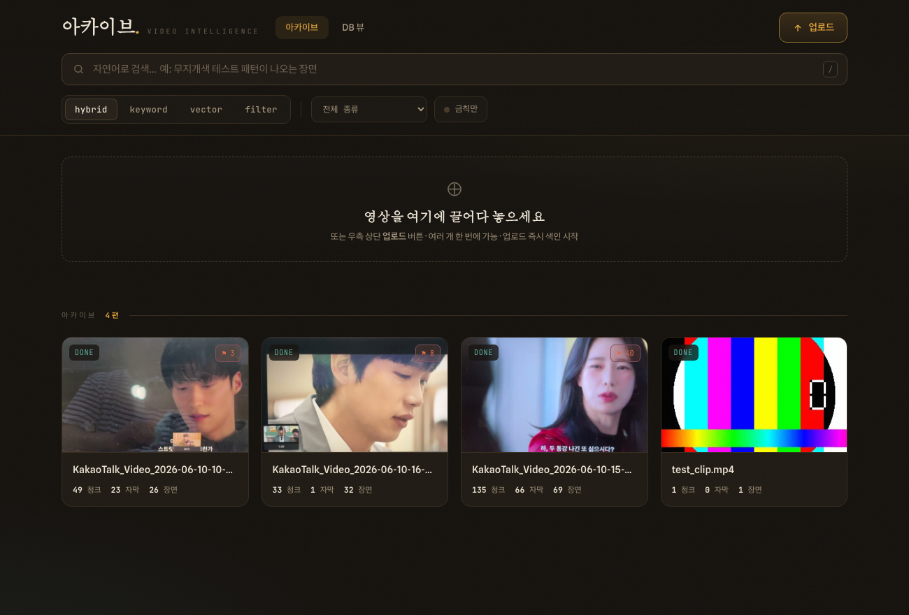
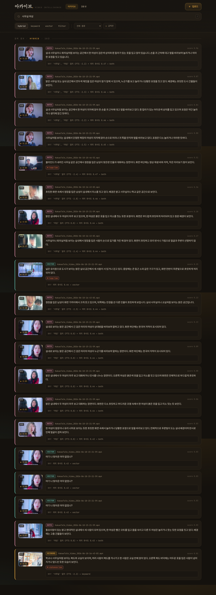
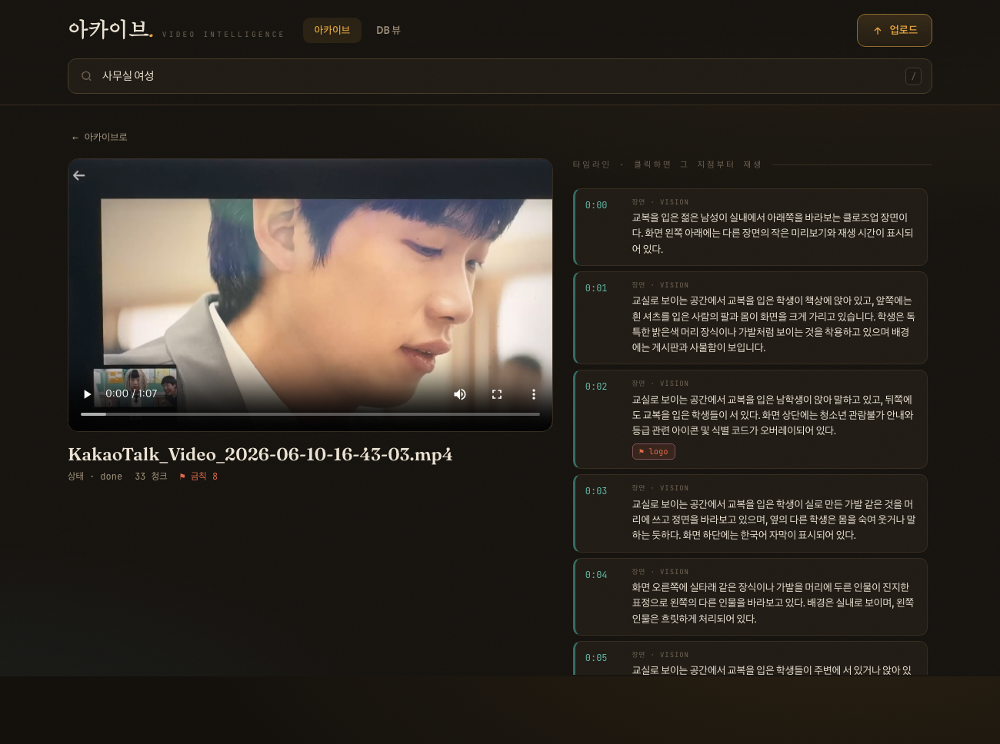
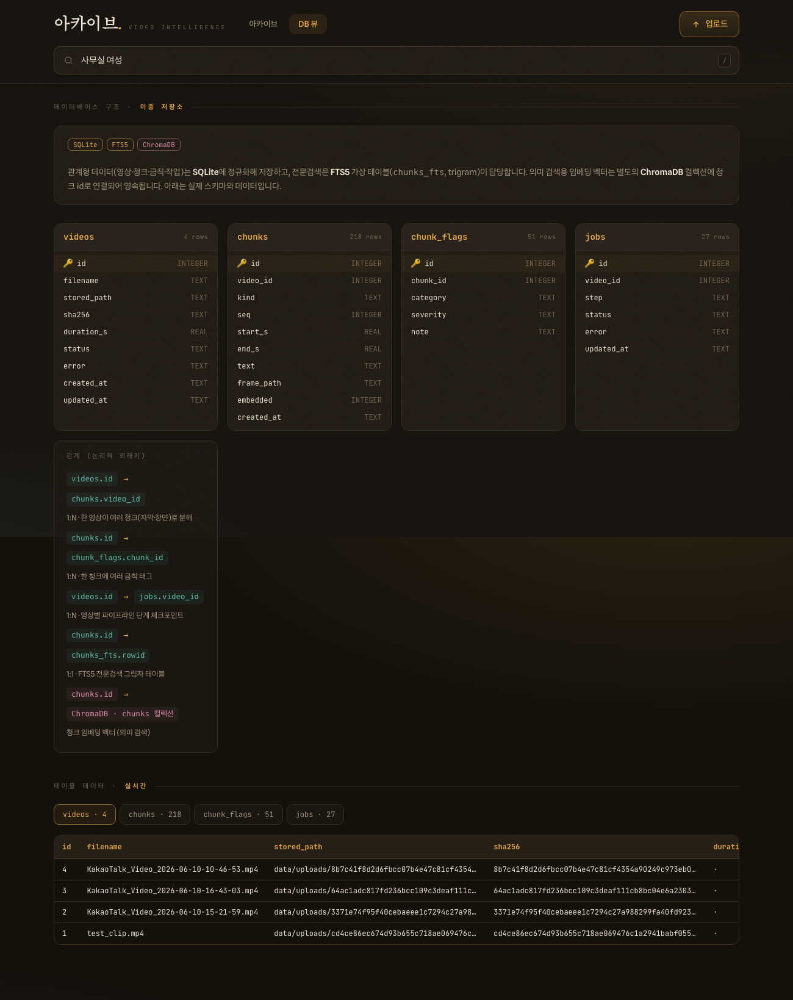

# 아카이브 · Video Intelligence Archive

영상을 업로드하면 AI가 **듣고(STT) · 보고(Vision) · 정리**해서, 나중에 자연어로 찾을 수 있는
**멀티모달 영상 아카이브 + 설명 가능한(explainable) 검색** 서비스.

검색 결과마다 **출처(keyword / vector / both)** 와 **왜 나왔는지** 설명을 함께 반환하는 것이 핵심 차별점입니다.



---

## 핵심 기능

- **멀티모달 색인 파이프라인** — Whisper STT → GPT 자막 교정 → ffmpeg 장면(keyframe) 추출 → GPT Vision 장면 분석·금칙 태깅(**전후 대사 맥락 융합**) → 임베딩
- **이중 저장소** — SQLite(정규화 + FTS5 전문검색) + ChromaDB(영속 벡터)
- **하이브리드 검색 4모드** — `hybrid` · `keyword` · `vector` · `filter`, 점수 합산
- **설명 가능한 검색** — 결과마다 출처 배지 + "왜 나왔는지" 결정론적 설명
- **단계별 체크포인트 · 부분 색인** — 한 단계가 실패해도 가능한 범위까지 색인하고, 재시작 시 이어서 처리
- **실시간 진행 상황** — 브라우저 SSE 프로그래스 바 + 텔레그램 완료 알림
- **텔레그램 봇** — 처리 완료 알림 + `/search` 봇 검색
- **DB 뷰 페이지** — 관계형 스키마·관계·실데이터를 브라우저에서 열람
- **검색 품질 자동 평가** — LLM 골드셋 생성 → Recall@5 · Precision@5 · MRR → 실패 패턴 분석 → HTML 리포트

## 화면

### 설명 가능한 검색 (출처 배지 + WHY + 장면 썸네일)


### 영상 상세 — 재생 + 클릭 가능한 자막/장면 타임라인


### DB 뷰 — 관계형 구조 + 실시간 데이터


---

## 검색 동작

자연어 쿼리는 GPT가 `{keywords, semantic_query, filters}`로 분해하고(유의어 확장 포함, 예: `오피스→사무실`),

- **keyword** — FTS5(trigram) + 1~2글자 한글은 LIKE 부분일치 보완, **coverage(매칭 키워드 수) 우선** 랭킹
- **vector** — `text-embedding-3-small` 임베딩 → ChromaDB 유사도
- **hybrid** — `score = α·vector + (1−α)·keyword` (α 기본 0.5), 한쪽만 매칭 시 결측 0
- **filter** — 메타데이터(종류·금칙·영상) 필터

각 결과는 출처(`keyword`/`vector`/`both`)와 설명(예: `'여성','사무실' 일치 (FTS −2.8) + 의미 유사도 0.54 → both`)을 함께 반환합니다.

## 검색 품질 평가 파이프라인

`eval/run_eval.py` — 사람 개입 없이 끝까지 자동 실행:

1. 코퍼스의 장면 설명에서 LLM이 **골드 쿼리 100개** 생성 (정답 = 출처 장면, known-item)
2. 각 쿼리로 **벡터 검색** 실행
3. **Recall@5 · Precision@5(LLM-as-judge) · MRR** 계산
4. 실패(top-5 미포함) 케이스 **패턴 분석**
5. 자체 완결 **HTML 리포트** 출력 → `eval/report.html` (앱에서 `평가 ↗` 탭으로도 열람)

```bash
python eval/run_eval.py            # 기본 100개
EVAL_N=20 python eval/run_eval.py  # 빠른 확인
```

## 아키텍처

```
업로드 → [persist → audio → transcribe(Whisper) → subtitle(GPT) →
          keyframes(ffmpeg) → vision(GPT) → embed → index-sql → index-vec → finalize]
                     │ 단계별 체크포인트 · 부분 색인 · 재개
                     ▼
        SQLite(테이블+FTS5)  +  ChromaDB(벡터)
                     │
         검색 엔진(4모드 + 설명)  ←  웹 UI · 텔레그램 봇 (공유)
```

모든 외부 클라이언트(OpenAI · Chroma · Telegram)는 **사용 시점 지연 초기화**, 상태는 모두 `./data`에 파일로 영속.

## 빠른 시작

전제: Python 3.11+, 시스템 `ffmpeg`.

```bash
python3 -m venv .venv && source .venv/bin/activate
pip install -r requirements.txt

cp .env.example .env          # OPENAI_API_KEY 입력 (텔레그램은 선택)

uvicorn archive.web.app:app --reload
# → http://localhost:8000
```

`.env` 키:

| 키 | 용도 |
|---|---|
| `OPENAI_API_KEY` | 필수 — STT·교정·Vision·임베딩·쿼리분해 |
| `TELEGRAM_BOT_TOKEN`, `TELEGRAM_CHAT_ID` | 선택 — 알림 + 봇 검색 |
| `HYBRID_ALPHA`, `KEYFRAME_THRESHOLD` | 선택 — 하이브리드 가중치 / 장면 임계값 |

자세한 운영은 `docs/RUNBOOK.md` 참고.

## 프로젝트 구조

```
archive/
├── config.py            # .env + 지연 초기화
├── events.py            # 진행 이벤트 버스
├── media.py             # ffmpeg 오디오/keyframe
├── transcribe.py        # Whisper STT
├── embed.py             # text-embedding-3-small
├── enrich/{subtitle,vision}.py   # GPT 자막 교정 / Vision 장면·금칙
├── store/{sqlite_store,vector_store}.py
├── pipeline.py          # 단계 오케스트레이션
├── search/{query,engine,explain}.py
├── notify/telegram.py
└── web/{app.py,static/index.html}
eval/run_eval.py         # 검색 품질 자동 평가
docs/                    # 설계 스펙 · 구현 계획 · 런북
```

## 기술 스택

Python · FastAPI · ChromaDB · SQLite(FTS5) · OpenAI(GPT-5.5 / Whisper / text-embedding-3-small) · ffmpeg · SSE · 바닐라 JS

## 장면 이해 — 대사 맥락 융합

단일 keyframe(클로즈업)만 보면 학교/사무실 같은 실내 장소가 구분되지 않습니다. 그래서 Vision
호출 시 **그 시점 전후의 대사(자막)를 함께 투입**해, 이미지만으로 모호한 장소·상황·관계를 대사로
추론하게 합니다(근거 없으면 단정하지 않음). keyframe 타임스탬프는 ffmpeg `showinfo`의 실제
`pts_time`을 사용해 대사와 정렬하고, UI 시킹도 실제 시각으로 동작합니다.

## 알려진 한계

- keyword 단독 모드는 한글 2글자 미만 단어와 유의어를 못 잡습니다 → `hybrid`/`vector`가 보완(기본값 hybrid)
- 무음/배경음 구간에서 Whisper가 환각 자막(예: "ご視聴ありがとうございました")을 만들 수 있어, 대사 맥락이 빈약하거나 오염될 수 있습니다

---

> 개인 학습/포트폴리오 프로젝트. 업로드 영상·API 키 등 데이터(`data/`, `.env`)는 저장소에 포함되지 않습니다.
